# Аналіз ДТП в Україні за 2024 рік 
&nbsp; 
## 📌 Project Overview 

Цей проект представляє поглиблений аналіз ДТП в Україні за 2024 рік з використанням Tableau та Google Sheets для візуалізації даних. Мета полягає в тому, щоб визначити основні тенденції ДТП, регіони високого ризику та основні фактори, що сприяють ДТП.
&nbsp; 
## 🎯 Key Objectives

  - Аналіз розподілу аварійності по регіонах України
  - Дослідження часові закономірності (щогодинні та щоденні тенденції) 
  - Визначення головних причини ДТП
  - Порівняння різних категорії ДТП (пов’язані з пішоходами, з водіями автобуса тощо)
  - Візуалізування результатів за допомогою інтерактивних інформаційних панелей Tableau
    
&nbsp;
 ## 📊 Data Sources
 
 Цей проєкт базується на офіційних даних про [дорожньо-транспортні пригоди (ДТП)](https://patrolpolice.gov.ua/statystyka/) від Національної поліції України, що забезпечує точність і достовірність аналізу.
 
 Набір даних містить офіційну інформацію про загальну кількість ДТП за 2024 рік, включаючи інформацію про вид пригоди, причини, час та наслідки.
 
&nbsp; 
## 🛠 Tools & Technologies
 &nbsp;&nbsp;&nbsp;&nbsp; 🔹 Tableau – Візуалізація даних і створення дашборду  
 &nbsp;&nbsp;&nbsp;&nbsp; 🔹 Google Sheets – Зберігання та обробка даних  
&nbsp;&nbsp;&nbsp;&nbsp;  🔹 GeoJSON – Геопросторовий аналіз 

&nbsp; 
## 📌 Key Insights from the Analysis
  - Найбільше аварій трапляється у п’ятницю та в години пік (8:00-10:00, 17:00-19:00).
  - Перевищення швидкості є основною причиною ДТП.
  - Найбільше зафіксовано інцидентів у Києві, Дніпрі та Львівській областях.
  - ДТП, пов’язані з пішоходами, залишаються серйозною проблемою в містах.

&nbsp; 
## Insights Deep-Dive

### Географічний аналіз дорожньо-транспортних пригод в Україні
---
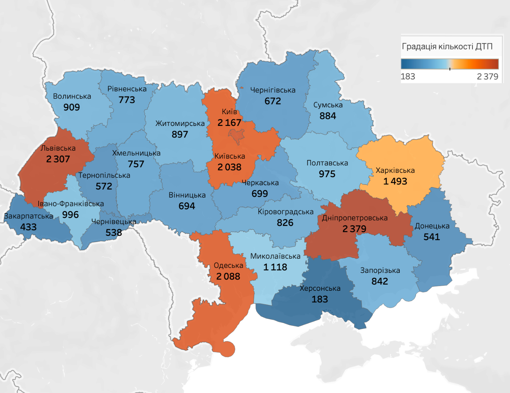

#### Картографічне відображення аварійності  

Одним із ключових етапів аналізу дорожньо-транспортних пригод (**ДТП**) є **візуалізація їхнього просторового розподілу**.  
Для цього була створена карта аварійності, яка відображає **кількість зафіксованих ДТП у розрізі регіонів України**.  

#### Ця візуалізація дозволяє:  

  - **Визначити** регіони з **найвищим** та **найнижчим рівнем аварійності**.  
  - **Виявити** можливі **просторові закономірності** у розподілі ДТП.  
  - **Зіставити** рівень аварійності з іншими факторами, такими як:
     - Щільність населення  
     - Стан дорожньої інфраструктури
     - Погодні умови  

#### Опис візуалізації  

**На карті представлені адміністративні області України**, кольори яких відображають **кількість ДТП у 2024 році**.  

- **Колірна шкала** відображає інтенсивність аварійності:
  
  - **Холодні відтінки (синій)** – регіони з **найнижчим рівнем ДТП**.  
  - **Теплі відтінки (жовтий, помаранчевий, червоний)** – **висока концентрація аварій**.  

- **Числовий діапазон на легенді** визначає **мінімальне та максимальне значення кількості ДТП** серед усіх регіонів.  

&nbsp;
### Регіони України з найбільшою кількістю ДТП
---
Аналіз дорожньо-транспортних пригод (ДТП) в Україні у 2024 році дозволив виявити п’ять регіонів з найвищим рівнем аварійності. Ці області мають найбільшу кількість зафіксованих ДТП, що може бути пов’язано з інтенсивністю руху, інфраструктурними особливостями та рівнем урбанізації.

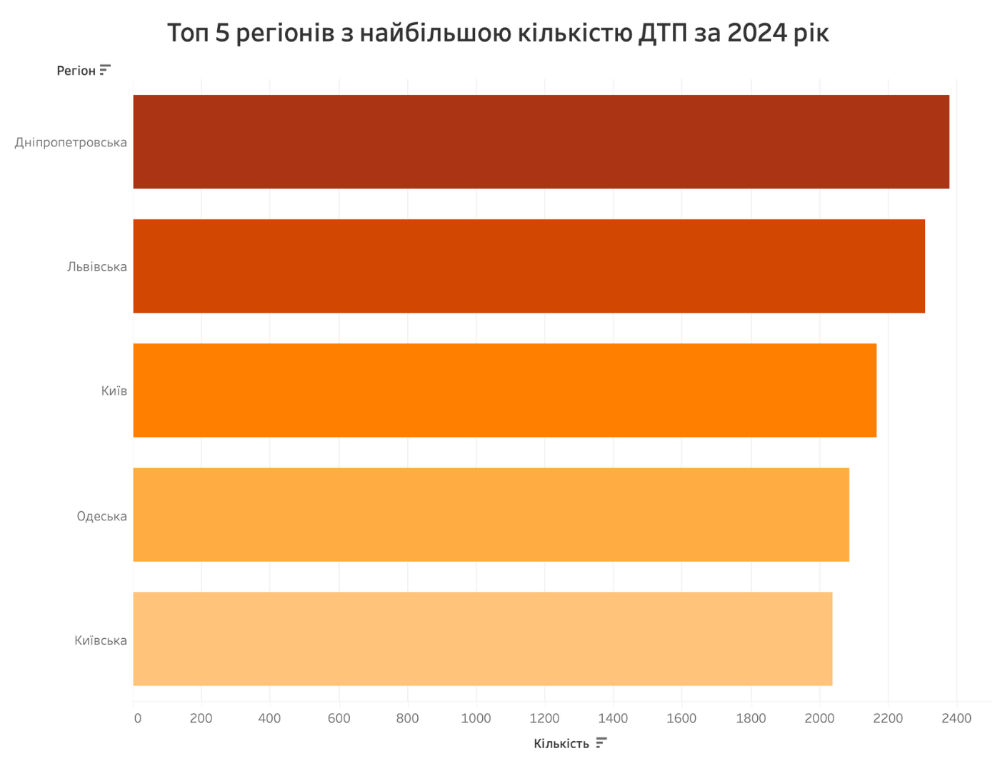

**На графіку представлено п’ять областей України з найбільшою кількістю дорожньо-транспортних пригод**  

- **Київська область та місто Київ** демонструють **високу аварійність**, що можна пояснити:  
  - великою щільністю населення,  
  - високою інтенсивністю руху,  
  - значною кількістю транзитного транспорту.  

- **Одеська та Львівська області** мають **значну кількість ДТП**, що може бути пов’язано з:  
  - туристичними потоками,  
  - перевантаженістю магістральних доріг,  
  - інтенсивним транзитним рухом.  

- **Дніпропетровська область** демонструє **один із найвищих рівнів аварійності**, що може свідчити про:  
  - високе навантаження на дорожню інфраструктуру,  
  - значну кількість **промислових перевезень**,  
  - активний рух у містах області.  

&nbsp;
### Порівняння ключових показників ДТП між 2023 та 2024 роками
---
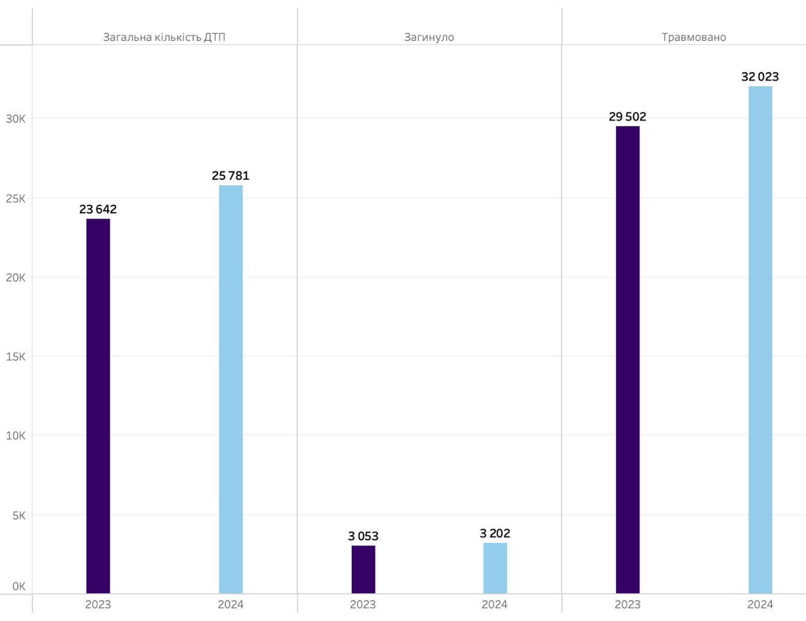

#### Графік демонструє зміни в основних показниках дорожньо-транспортних пригод (ДТП) за 2023 та 2024 роки, включаючи:

  - Загальну кількість ДТП,
  - Кількість загиблих,
  - Кількість травмованих.

#### Загальні тенденції

1. **Зростання загальної кількості ДТП**
    
    - У 2023 році було зафіксовано **23 642 ДТП**, а у 2024 році цей показник зріс до **25 781**.
    - **Збільшення на 9%** може свідчити про зростання інтенсивності руху погіршення дорожньої дисципліни або інші фактори, що впливають на безпеку.

2. **Збільшення кількості загиблих**
    
    - У 2023 році загинуло **3 053 осіб**, а у 2024 році – **3 202**.
    - Хоча зростання **менше 5%**, воно все ще є тривожним сигналом щодо підвищення ризиків на дорогах.

3. **Збільшення кількості травмованих**
    
    - У 2023 році травмовано **29 502 осіб**, а у 2024 – **32 023**.
    - Ріст на 8,5% свідчить про збільшення важкості аварій, що може бути пов’язано з перевищенням швидкості або зростанням кількості аварій на небезпечних ділянках.

### Причини ДТП   
---
**На графіку представлено основні причини дорожньо-транспортних пригод (ДТП)**  

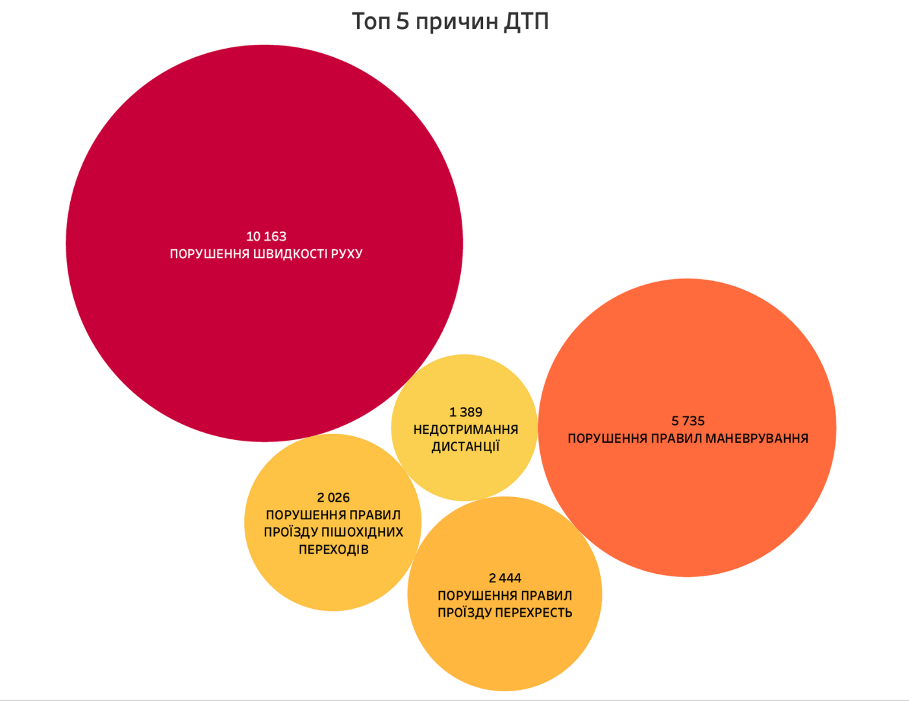

#### Основні причини ДТП  

**1. Перевищення швидкості** – **10 163 випадки**  
&nbsp;&nbsp;&nbsp; Це найпоширеніша причина ДТП. Перевищення допустимої швидкості зменшує контроль над автомобілем і збільшує ризик фатальних наслідків.  

**2. Порушення правил маневрування** – **5 735 випадків**  
&nbsp;&nbsp;&nbsp; Неправильна зміна смуги, невчасні повороти або виїзд на зустрічну смугу стають причиною значної кількості аварій.  

**3. Порушення правил проїзду перехресть** – **2 444 випадки**  
&nbsp;&nbsp;&nbsp; Недотримання пріоритетів руху, проїзд на заборонений сигнал світлофора або неправильне маневрування на перехрестях призводить до зіткнень.  

**4. Порушення правил проїзду пішохідних переходів** – **2 026 випадків**  
&nbsp;&nbsp;&nbsp; Недотримання пріоритету для пішоходів є серйозною проблемою, яка спричиняє численні наїзди.  

**5. Недотримання дистанції** – **1 389 випадків**  
&nbsp;&nbsp;&nbsp; Водії часто не дотримуються безпечної дистанції, що стає причиною лобових та ланцюгових зіткнень.  

&nbsp;
### Основні типи ДТП 
---
**На графіку представлено найпоширеніші види дорожньо-транспортних пригод (ДТП) із загиблими та/або травмованими**  
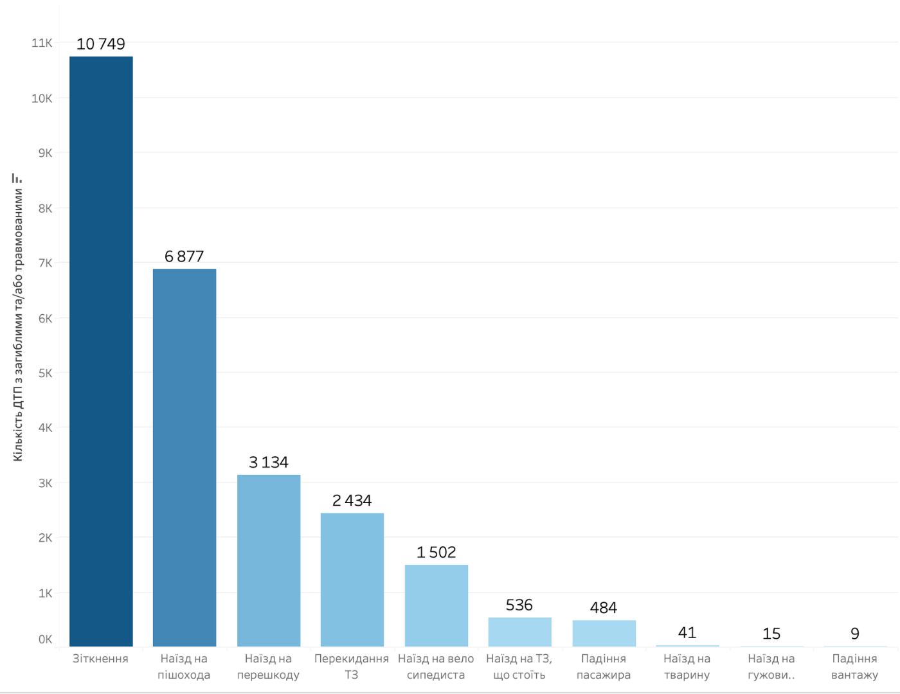

####  Найпоширеніші види ДТП  

   **1. Зіткнення** – **10 749 випадків**  
&nbsp;&nbsp;&nbsp; Це **найчастіший тип аварій**, який виникає через порушення швидкісного режиму, неправильне маневрування або несприятливі погодні умови.  
  
   **2. Наїзд на пішохода** – **6 877 випадків**  
&nbsp;&nbsp;&nbsp; Багато аварій трапляються на нерегульованих переходах або через неуважність водіїв та пішоходів.  

  **3. Наїзд на перешкоду** – **3 134 випадки**  
&nbsp;&nbsp;&nbsp; Часто відбувається через **перевищення швидкості** або втрату контролю над транспортним засобом.  

  **4. Перекидання транспортного засобу** – **2 434 випадки**  
&nbsp;&nbsp;&nbsp; Виникає при різкому маневруванні, заносах або перевищенні швидкості на поворотах.  

  **5. Наїзд на велосипедиста** – **1 502 випадки**  
&nbsp;&nbsp;&nbsp; Небезпечна категорія ДТП, що часто трапляється через недотримання дистанції або невидимість велосипедистів у темну пору доби.  

&nbsp;
### Частка ДТП у населених пунктах та поза їх межами  
---

**На графіку відображено розподіл дорожньо-транспортних пригод (ДТП) залежно від місця їхнього виникнення – у населених пунктах або поза їх межами.**  
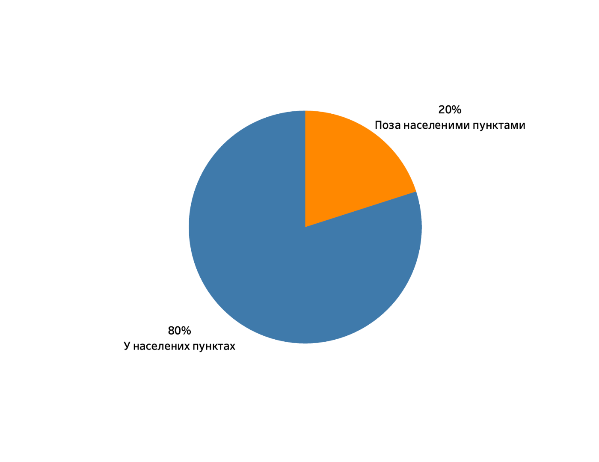

#### Основні спостереження  

**80% ДТП стаються у населених пунктах**  
  - **Основні фактори ризику:**
    - Висока щільність транспорту та пішоходів  
    - Часті світлофорні перехрестя та пішохідні переходи  
    - Недотримання швидкісного режиму в міських умовах  
    - Обмежена видимість на вузьких дорогах  

**20% ДТП відбуваються поза населеними пунктами**  
  - **Головні ризики:**  
    - Перевищення швидкості на трасах  
    - Засинання водіїв під час тривалих поїздок  
    - Відсутність якісного освітлення вночі  
    - Високий рівень летальних випадків через більшу швидкість зіткнень
      
&nbsp;
### Аналіз аварійності за днями тижня  
---
**На графіку представлено розподіл дорожньо-транспортних пригод (ДТП) за днями тижня**  
Цей аналіз допомагає виявити, у які дні трапляється найбільше аварій і які фактори можуть впливати на рівень аварійності.  
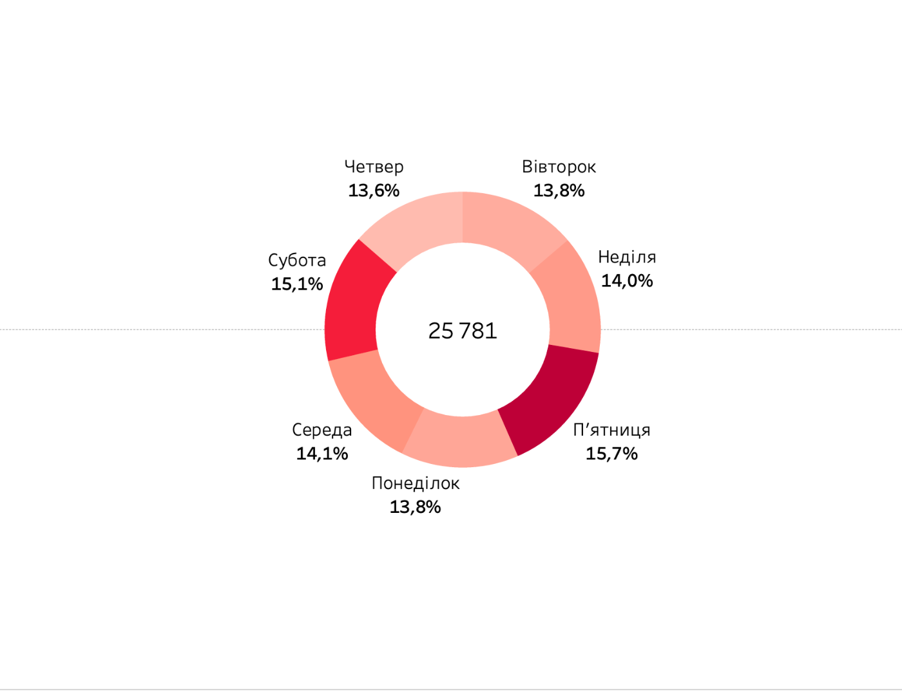

#### Основні спостереження  

  * **Найвища аварійність у п’ятницю (15,7%) та суботу (15,1%)**  

    **Основні причини:**  
    - Збільшений трафік через завершення робочого тижня  
    - Активні вечірні поїздки, відпочинок, розважальні заходи  
    - Вищий рівень керування транспортом у стані сп’яніння  

  * **Середній рівень аварійності у неділю (14,0%) та середу (14,1%)**  

    **Фактори впливу:**  
    - Недільні поїздки за місто, повернення додому  
    - Активність пішоходів та велосипедистів  
    - Втома водіїв посеред робочого тижня (середа)  

  * **Найменша аварійність у четвер (13,6%) та понеділок/вівторок (13,8%)**  

    **Можливі причини:**  
    - Менша інтенсивність руху порівняно з вихідними  
    - Більш структуровані графіки водіїв у робочі дні  
    - Менше непередбачуваних факторів у міському русі
      
&nbsp;
### Аналіз аварійності за часом доби  
---

**Графік відображає розподіл дорожньо-транспортних пригод (ДТП) протягом доби**  
Він допомагає виявити періоди підвищеного ризику та спланувати ефективні заходи для зниження кількості аварій.  
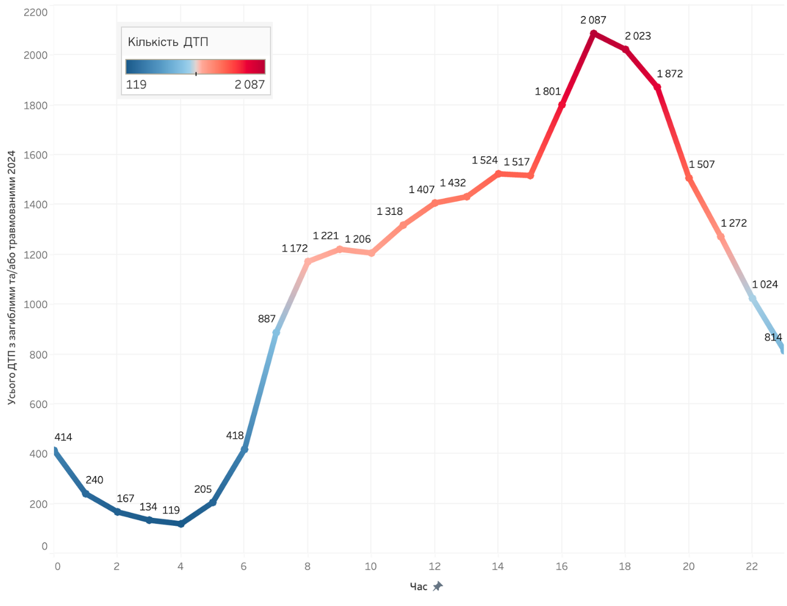

#### Основні спостереження  

  * **Нічні години (00:00 – 05:00) – найнижчий рівень ДТП**  
    - Найменше аварій фіксується з 3:00 до 5:00, коли трафік майже відсутній.  
    - Проте в цей період збільшується ризик **засинання водіїв** та **аварій з важкими наслідками**.  

  * **Ранковий пік (06:00 – 10:00) – різке зростання аварійності**  
    - О 6:00-7:00 кількість ДТП починає стрімко зростати через початок ранкових поїздок.  
    - Водії поспішають на роботу, перевищуючи швидкість та нехтуючи правилами.  

  * **Денна стабільність (10:00 – 15:00) – відносно стабільний рівень аварійності**  
    - У цей період відбувається **стабілізація** кількості ДТП.  
    - Рівень аварій залишається високим, проте не має різких стрибків.  

  * **Вечірній пік (16:00 – 20:00) – максимальна кількість ДТП**  
    - Найбільше аварій фіксується о **18:00 – 19:00**, коли люди повертаються з роботи.  
    - Основні причини:  
    - Втома водіїв після робочого дня  
    - Збільшення щільності руху у містах  
    - Недотримання дистанції та часті маневрування  

  * **Нічний спад (20:00 – 23:00) – поступове зниження аварійності**  
    - Після 21:00 кількість ДТП різко падає, але зростає частка **аварій, пов’язаних із нетверезими водіями**.
      
&nbsp;
### Аналіз частки ДТП за участю пішоходів до ДТП з вини пішоходів
---
**Графік відображає загальну кількість ДТП за участю пішоходів у кожній області України, а також ті випадки, що сталися з вини самих пішоходів.**  
Цей аналіз допомагає зрозуміти, наскільки значною є роль пішоходів у створенні аварійних ситуацій.  

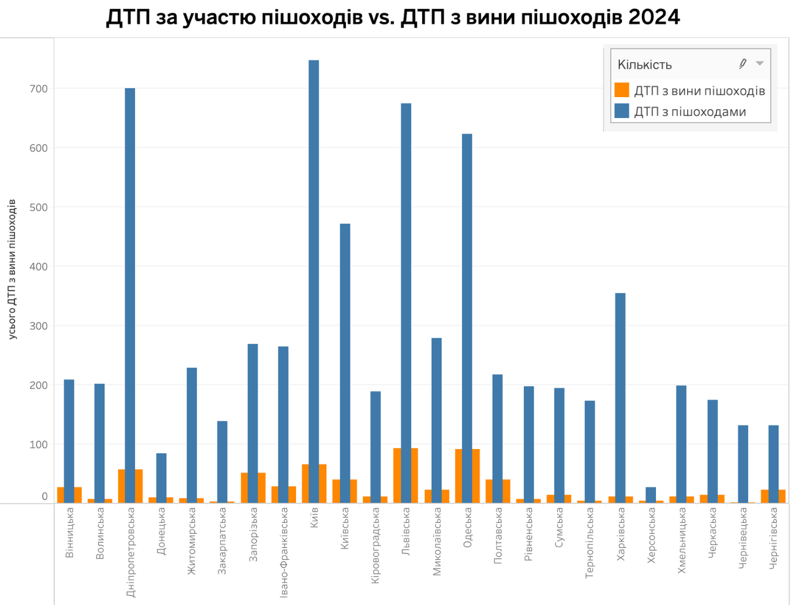

#### Основні спостереження  

**У кожній області кількість ДТП за участю пішоходів значно перевищує аварії з їхньої вини**  
  * Це свідчить про те, що **основна відповідальність за такі ДТП залишається на водіях**.  
  * Проте у деяких регіонах частка провини пішоходів є досить помітною.  

**Області з найвищою кількістю ДТП за участю пішоходів**  
  - **Київська, Дніпропетровська, Одеська, Львівська та Харківська області**  
    * Це великі міста з інтенсивним трафіком та високою кількістю пішоходів.
      
Головні ризики:  
  - Недотримання правил проїзду пішохідних переходів водіями  
  - Велика кількість неконтрольованих переходів  
  - Висока щільність руху у години пік  

**ДТП з вини пішоходів**  
  - **Найбільше таких випадків у великих містах та густонаселених регіонах**
    
Часто пішоходи порушують правила:  
  - Перехід дороги у недозволених місцях  
  - Вихід на проїжджу частину перед транспортом  
  - Недотримання сигналів світлофора

&nbsp;
### Частка ДТП за участю дітей до ДТП з вини дітей  
---
**На графіку відображено загальну кількість дорожньо-транспортних пригод (ДТП) за участю дітей у різних регіонах України**  
Також показана частка аварій, де діти стали безпосередніми винуватцями подій.  
Цей аналіз допомагає визначити найбільш ризиковані регіони та причини, які призводять до травмування дітей у ДТП.  

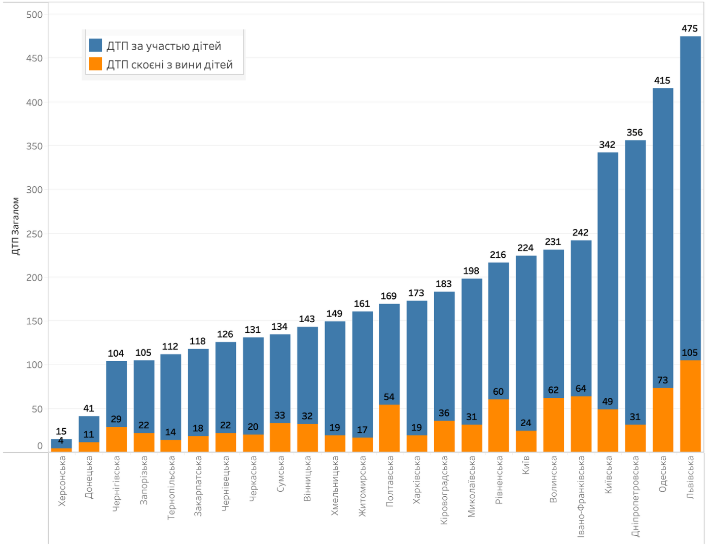

#### Основні спостереження  

**Значна кількість ДТП за участю дітей у найбільших містах України**  
  - **Львівська, Одеська, Дніпропетровська, Київська та Івано-Франківська області** мають **найвищі показники аварій за участю дітей**.
    
**Основні причини:**  
  - Велика кількість дітей-пішоходів та велосипедистів.  
  - Висока щільність дорожнього руху.  
  - Відсутність достатньої кількості безпечних переходів, велодоріжок та навчальних програм для дітей.  

**Частка ДТП, спричинених самими дітьми**  
  - **Лідери за кількістю таких випадків – Львівська, Одеська та Дніпропетровська області**.  
    - Це може бути пов’язано з активним рухом дітей на дорогах, відсутністю контролю з боку дорослих та незнанням правил дорожнього руху.  
    - У Київській області частка аварій з вини дітей нижча, що може свідчити про кращу інфраструктуру та навчальні ініціативи.  

**Регіони з найменшою кількістю ДТП за участю дітей**  
  - **Херсонська, Донецька, Чернігівська області** мають найнижчі показники, що може пояснюватися меншою щільністю населення, меншою активністю дітей на дорогах та неможливістю зібрати інформацію з окупованих територій.  

&nbsp;
### Аналіз кількості ДТП з вини водіїв автобусів
---
**Графік відображає розподіл дорожньо-транспортних пригод (ДТП), спричинених водіями автобусів у різних регіонах України**  
Цей аналіз допомагає зрозуміти, де найбільші ризики, пов’язані з громадським транспортом, та які регіони потребують посиленого контролю.  

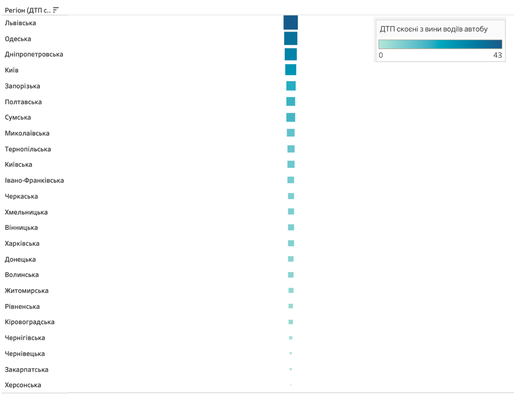 

**Найбільше ДТП, спричинених водіями автобусів, зафіксовано у великих містах**  

**Лідери за кількістю аварій:**  
  - **Київ, Львівська, Одеська та Дніпропетровська області**  
  - Ці регіони мають **високу щільність пасажирських перевезень**, що підвищує ризики аварій  
  - Основні фактори: **порушення швидкісного режиму, неправильне маневрування, перевищення кількості пасажирів**  

**Регіони з низьким рівнем ДТП за участю автобусів:**  
  - **Закарпатська, Чернігівська, Херсонська, Кіровоградська області**  
  - У цих регіонах менша кількість громадського транспорту або менш інтенсивний трафік  

**Основні причини ДТП з вини водіїв автобусів:**  
  - **Недотримання швидкісного режиму**  
  - **Проїзд на заборонений сигнал світлофора**  
  - **Неправильне маневрування на зупинках**  
  - **Відволікання водіїв на дорозі**  

&nbsp;
### 📌 Conclusion: Аналіз ДТП в Україні у 2024 році  
---

**Загальний аналіз дорожньо-транспортних пригод (ДТП) в Україні у 2024 році виявив ключові проблеми та тенденції, які впливають на рівень безпеки на дорогах.**  

#### Основні тенденції  

✔️ **Рівень аварійності зростає** у великих містах та регіонах з інтенсивним рухом (Київ, Львів, Одеса, Дніпро).  
✔️ **Пікові години ДТП – ранок (06:00 – 10:00) та вечір (16:00 – 20:00),** що пов’язано з поїздками на роботу та поверненням додому.  
✔️ **Вихідні дні (п’ятниця-субота) мають підвищений рівень аварійності**, особливо через перевищення швидкості та нетверезе водіння.  
✔️ **Більшість ДТП за участю пішоходів спричинені водіями**, проте є випадки порушень і з боку пішоходів.  
✔️ **Найбільше ДТП за участю дітей фіксується у густонаселених регіонах**, що вимагає додаткових заходів безпеки біля шкіл та ігрових зон.  
✔️ **ДТП з автобусами найчастіше трапляються у містах з високою щільністю громадського транспорту,** що потребує кращого контролю за водіями.  

#### Ключові ризики  

  * **Перевищення швидкості** залишається однією з головних причин ДТП.  
  * **Недотримання правил маневрування** часто призводить до аварій у міських умовах.  
  * **Висока аварійність за участю пішоходів** вимагає покращення інфраструктури переходів та світлофорів.  
  * **Водії автобусів** у великих містах потребують додаткового навчання та контролю.  
  * **Нетверезе водіння – одна з найбільш критичних проблем, особливо у вихідні дні.**  

&nbsp;
### 🛠️ Recommendations  
---

**Що можна покращити для підвищення безпеки на дорогах?**  

✅ **Посилення контролю за швидкістю** (камера автофіксації, обмеження у міських зонах).  
✅ **Розвиток інфраструктури для пішоходів та велосипедистів** (краще освітлення, розширення переходів).  
✅ **Збільшення штрафів та посилений контроль за нетверезими водіями.**  
✅ **Навчальні кампанії для дітей, пішоходів та водіїв** щодо дотримання правил дорожнього руху.  
✅ **Покращення безпеки громадського транспорту** (моніторинг маршрутів, навчання водіїв).  
✅ **Впровадження зон відпочинку на трасах** для зменшення ризику засинання водіїв.  

#### Підсумок  

  - Аналіз ДТП у 2024 році показує, що проблема безпеки на дорогах залишається критичною.
  - Основні ризики зосереджені у великих містах та на швидкісних магістралях.
  - Комплексні заходи – контроль, навчання, інфраструктурні зміни – допоможуть зменшити кількість аварій.

**Застосування цих рекомендацій сприятиме зниженню аварійності та покращенню безпеки для всіх учасників дорожнього руху!**  

