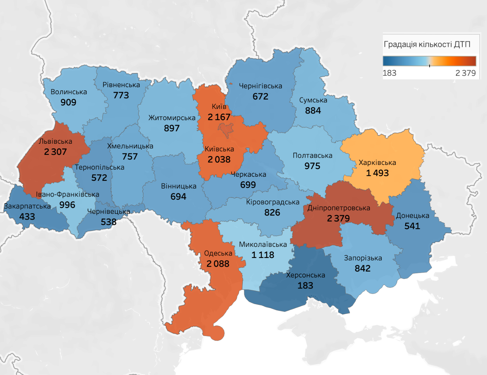
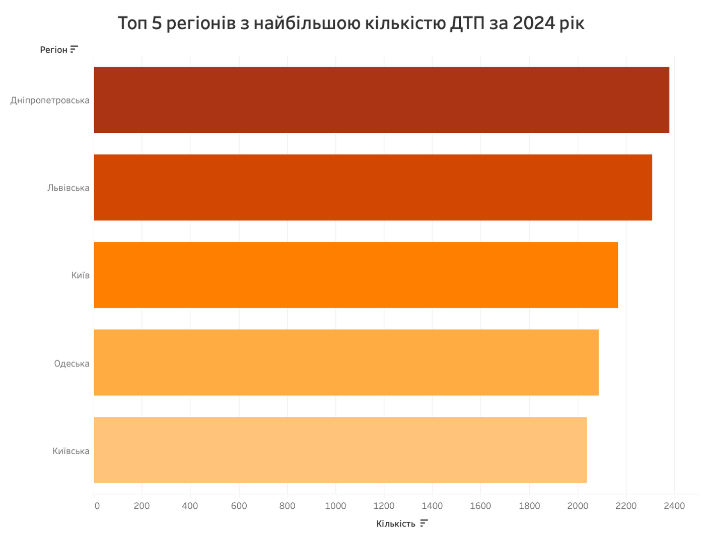
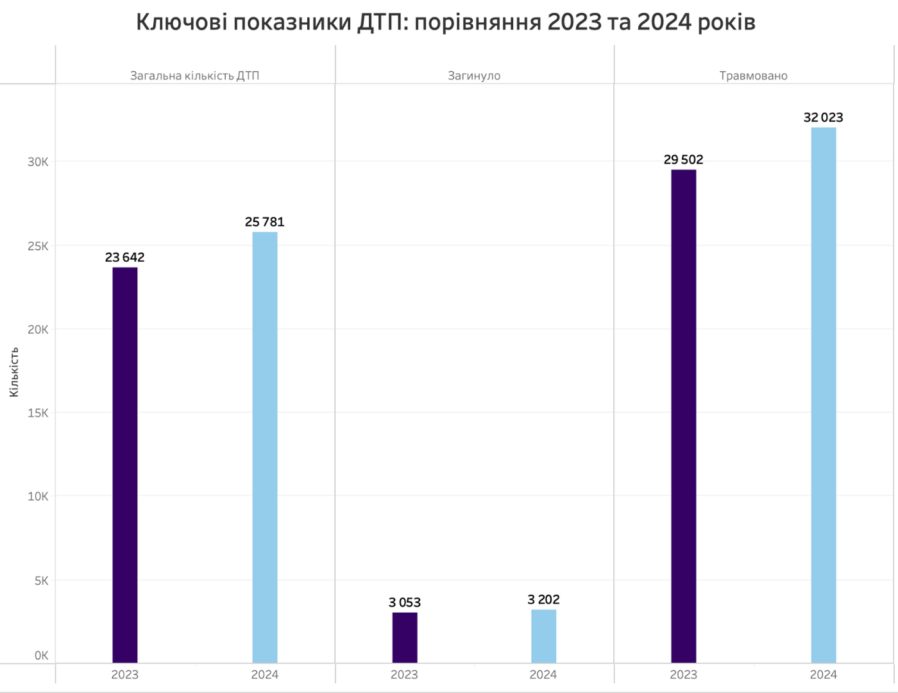

# Аналіз ДТП в Україні за 2024 рік 
&nbsp; 
## 📌 Project Overview 

Цей проект представляє поглиблений аналіз ДТП в Україні за 2024 рік з використанням Tableau та Google Sheets для візуалізації даних. Мета полягає в тому, щоб визначити основні тенденції ДТП, регіони високого ризику та основні фактори, що сприяють ДТП.
&nbsp; 
## 🎯 Key Objectives

  - Аналіз розподілу аварійності по регіонах України
  - Дослідження часові закономірності (щогодинні та щоденні тенденції) 
  - Визначення головних причини ДТП
  - Порівняння різних категорії ДТП (пов’язані з пішоходами, з водіями автобуса тощо)
  - Візуалізування результатів за допомогою інтерактивних інформаційних панелей Tableau
    
&nbsp;
 ## 📊 Data Sources
 
 Цей проєкт базується на офіційних даних про [дорожньо-транспортні пригоди (ДТП)](https://patrolpolice.gov.ua/statystyka/) від Національної поліції України, що забезпечує точність і достовірність аналізу.
 
 Набір даних містить офіційну інформацію про загальну кількість ДТП за 2024 рік, включаючи інформацію про вид пригоди, причини, час та наслідки.
 
&nbsp; 
## 🛠 Tools & Technologies
 &nbsp;&nbsp;&nbsp;&nbsp; 🔹 Tableau – Візуалізація даних і створення дашборду  
 &nbsp;&nbsp;&nbsp;&nbsp; 🔹 Google Sheets – Зберігання та обробка даних  
&nbsp;&nbsp;&nbsp;&nbsp;  🔹 GeoJSON – Геопросторовий аналіз 

&nbsp; 
## 📌 Key Insights from the Analysis
✅ Найбільше аварій трапляється у п’ятницю та в години пік (8:00-10:00, 17:00-19:00).
✅ Перевищення швидкості є основною причиною ДТП.
✅ Найбільше зафіксовано інцидентів у Києві, Дніпрі та Львівській областях.
✅ ДТП, пов’язані з пішоходами, залишаються серйозною проблемою в містах.

&nbsp; 
## Insights Deep-Dive

### Географічний аналіз дорожньо-транспортних пригод в Україні

#### Картографічне відображення аварійності
 
 &nbsp;&nbsp;&nbsp;&nbsp; Одним із ключових етапів аналізу дорожньо-транспортних пригод (ДТП) є візуалізація їхнього просторового розподілу. Для цього була створена карта аварійності, яка відображає кількість зафіксованих ДТП у розрізі регіонів України.

#### Ця візуалізація дозволяє:

  - Визначити регіони з найвищим та найнижчим рівнем аварійності.
  - Виявити можливі просторові закономірності у розподілі ДТП.
  - Зіставити рівень аварійності з іншими факторами, такими як щільність населення, стан дорожньої інфраструктури та погодні умови.
    
#### Опис візуалізації

На карті представлені адміністративні області України, кольори яких відповідають кількості ДТП у 2024 році.

   - Колірна шкала відображає інтенсивність аварійності:
      - Холодні відтінки (синій) позначають області з найнижчим рівнем ДТП.
      - Теплі відтінки (жовтий, помаранчевий, червоний) вказують на високу концентрацію аварій.
        
  - Числовий діапазон на легенді визначає мінімальне та максимальне значення кількості ДТП серед усіх регіонів.

&nbsp;
### Регіони України з найбільшою кількістю ДТП

Аналіз дорожньо-транспортних пригод (ДТП) в Україні у 2024 році дозволив виявити п’ять регіонів з найвищим рівнем аварійності. Ці області мають найбільшу кількість зафіксованих ДТП, що може бути пов’язано з інтенсивністю руху, інфраструктурними особливостями та рівнем урбанізації.

📊 На графіку представлено п’ять областей України з найбільшою кількістю дорожньо-транспортних пригод у 2024 році.

  - Київська область та місто Київ демонструють високу аварійність, що можна пояснити великою щільністю населення, високою інтенсивністю руху та великою кількістю транзитного транспорту.

  - Одеська та Львівська області також мають значну кількість ДТП, що може бути пов’язано з туристичними потоками, перевантаженістю магістралей та транзитним транспортом.

  - Дніпропетровська область показує один із найвищих рівнів аварійності, що може свідчити про високе навантаження на дорожню інфраструктуру через промислові перевезення та активний рух у містах області.

Загальна тенденція:
Регіони з найбільшими містами та інтенсивним рухом (Київ, Львів, Одеса, Дніпро) мають найвищий рівень ДТП. Це підкреслює важливість заходів з покращення безпеки дорожнього руху, зокрема розвитку інфраструктури, контролю швидкості та вдосконалення транспортної логістики.

&nbsp;
### Порівняння ключових показників ДТП між 2023 та 2024 роками

